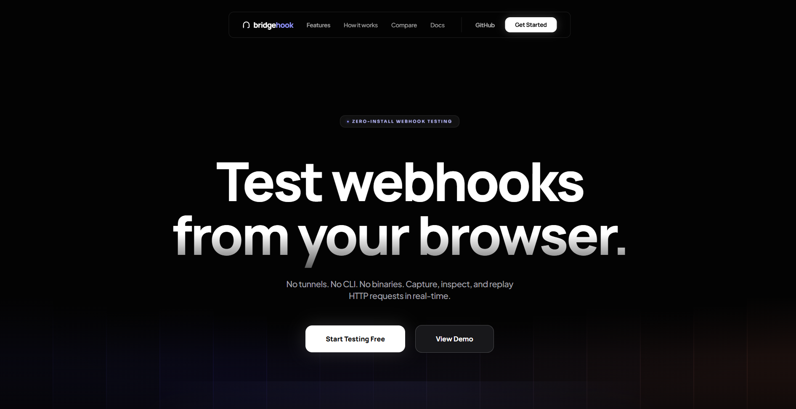

<p align="center">
  
</p>

<h1 align="center">bridgehook</h1>

<p align="center">
  <strong>Zero-install webhook testing. Your browser is the bridge.</strong>
</p>

<p align="center">
  <a href="#quickstart">Quickstart</a> &bull;
  <a href="#how-it-works">How It Works</a> &bull;
  <a href="#documentation">Docs</a> &bull;
  <a href="#self-hosting">Self-Host</a> &bull;
  <a href="#downloads">Downloads</a>
</p>

<p align="center">
  <a href="https://github.com/halleluyahadeaga/bridgehook/actions/workflows/ci.yml"></a>
  <a href="https://github.com/halleluyahadeaga/bridgehook/releases"></a>
  <a href="https://github.com/halleluyahadeaga/bridgehook/blob/main/LICENSE"></a>
  
</p>

---

## What is BridgeHook?

BridgeHook forwards webhooks from the internet to your localhost **using your browser as the proxy**. No CLI, no binary, no npm package, no account.

```
Stripe → POST → Relay Server → SSE → Your Browser → fetch() → localhost:3000
```

Open a URL. Enter your port. Get a webhook endpoint. Done.

## Why?

| | ngrok | Cloudflare Tunnel | localtunnel | **BridgeHook** |
|---|---|---|---|---|
| Install required | CLI binary | CLI binary | npm package | **Nothing** |
| Account required | Yes | Yes | No | **No** |
| Locked-down machines | Blocked | Blocked | Blocked | **Works** |
| Stable URLs (free) | Rotates | Yes | No | **Yes** |
| Built-in inspector | Paid | No | No | **Yes, free** |
| Cost | Free tier limited | Free | Free | **Free forever** |

## Quickstart

**1. Open the web app**
```
https://app.bridgehook.dev
```

**2. Enter your port and click Start Bridge**
```
Port: 3000
Paths: /webhook/stripe, /webhook/github
```

**3. Copy your webhook URL**
```
https://relay.bridgehook.dev/hook/ch_9x4kf2m
```

**4. Paste into Stripe/GitHub/Twilio — webhooks flow to localhost**

That's it. No install, no signup, no config files.

## How It Works

Your browser sits at the intersection of the internet and your localhost. BridgeHook's JavaScript runs **inside your browser** and:

1. Connects to the cloud relay via **Server-Sent Events (SSE)**
2. Receives webhook events in real-time
3. Calls `fetch("http://localhost:3000/webhook/stripe")` to forward them
4. Sends the response back to the relay → back to Stripe

The relay is a dumb pipe. The browser is the smart gatekeeper. The relay never touches your machine.

```
THE INTERNET                          YOUR MACHINE
┌─────────────────────────┐        ┌──────────────────────────────┐
│  Webhook Sender          │        │  Your Browser                │
│  (Stripe/GitHub)         │        │  ┌────────────────────────┐  │
│         │                │        │  │  BridgeHook JS         │  │
│         │ POST           │        │  │  1. SSE receive         │  │
│         ▼                │  SSE   │  │  2. fetch() localhost   │  │
│  Relay Server     ──────────────────  │  3. Send response back │  │
│  (Cloudflare Worker)     │        │  └────────────────────────┘  │
└─────────────────────────┘        │         │                     │
                                   │         ▼                     │
                                   │  localhost:3000               │
                                   └──────────────────────────────┘
```

## Architecture

```
bridgehook/
├── packages/shared/      Shared types, constants, Drizzle DB schema
├── apps/web/             Landing page + Dashboard (React + Vite)
├── apps/desktop/         System tray app (Tauri + Rust, Phase 2)
├── relay/                Cloudflare Worker + Neon PostgreSQL
└── docs/                 Documentation site (React + Vite)
```

| Component | Technology | Free Tier |
|-----------|-----------|-----------|
| Relay | Cloudflare Workers | 100K req/day |
| Database | Neon PostgreSQL + Drizzle | 0.5GB |
| Web App | Cloudflare Pages | Unlimited |
| Desktop | Tauri v2 | N/A |

## Downloads

### Web App (no download needed)
Just open your browser:
- **App:** [app.bridgehook.dev](https://app.bridgehook.dev)
- **Docs:** [docs.bridgehook.dev](https://docs.bridgehook.dev)

### Desktop App (Phase 2)

Background operation without a browser tab. Runs in system tray.

| Platform | Download | Package Manager |
|----------|----------|-----------------|
| **Windows** | [`.msi`](https://github.com/halleluyahadeaga/bridgehook/releases/latest) | `scoop install bridgehook` |
| **macOS** | [`.dmg`](https://github.com/halleluyahadeaga/bridgehook/releases/latest) | `brew install bridgehook/tap/bridgehook` |
| **Linux** | [`.AppImage`](https://github.com/halleluyahadeaga/bridgehook/releases/latest) | `snap install bridgehook` |

### Package Registries

```bash
# Homebrew (macOS/Linux)
brew install bridgehook/tap/bridgehook

# Scoop (Windows)
scoop bucket add bridgehook https://github.com/halleluyahadeaga/scoop-bridgehook
scoop install bridgehook

# npm (thin wrapper)
npx bridgehook

# Cargo (Rust)
cargo install bridgehook
```

## Self-Hosting

BridgeHook is fully open source. Run the entire stack yourself:

```bash
git clone https://github.com/halleluyahadeaga/bridgehook
cd bridgehook
pnpm install

# Database
neon projects create --name bridgehook
cd relay && DATABASE_URL="your-neon-url" npx drizzle-kit push

# Configure
echo 'DATABASE_URL=your-neon-url' > relay/.dev.vars
echo 'VITE_RELAY_URL=http://localhost:8787' > apps/web/.env

# Run
pnpm dev:relay  # Terminal 1
pnpm dev:web    # Terminal 2
```

Total cost: **$0/month** on free tiers.

## Documentation

Full docs at [docs.bridgehook.dev](https://docs.bridgehook.dev):

- **Getting Started** — Introduction, Quickstart
- **Core Concepts** — How It Works, SSE Technology, The Browser Bridge
- **Security** — Security Model, Channel Secrets, Path Allowlist
- **Comparison** — vs ngrok, vs Cloudflare Tunnel, vs localtunnel, Tradeoffs
- **API Reference** — Relay API, SSE Events
- **Deployment** — Self-Hosting, Architecture

## Security

- **Channel secrets** — SHA-256 hashed, raw secret never leaves your browser
- **Path allowlist** — Only approved endpoints forwarded to localhost
- **Auto-expiry** — Channels die after 24 hours
- **Rate limiting** — 60 req/min, 1MB max body, 100 event buffer
- **Unguessable IDs** — 128-bit random UUIDs
- **Instant kill** — Close tab = bridge dies immediately

## Contributing

See [CONTRIBUTING.md](CONTRIBUTING.md).

## License

MIT — See [LICENSE](LICENSE).

---

<p align="center">
  <sub>Built with Cloudflare Workers, Neon PostgreSQL, React, and Tauri.</sub>
</p>
