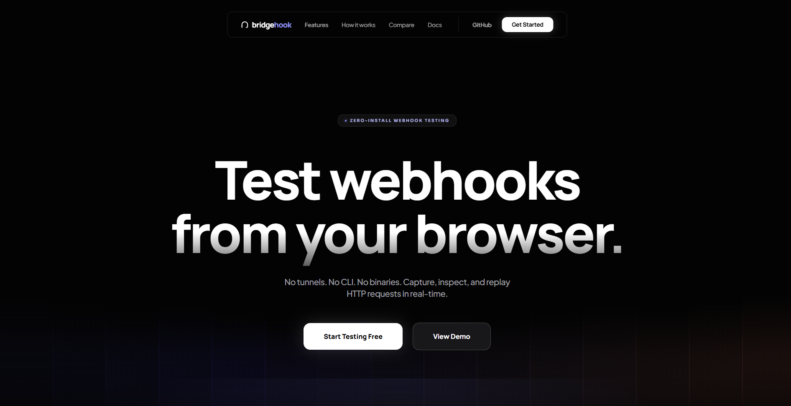

<p align="center">
  
</p>

<p align="center">
  
</p>

<p align="center">
  <strong>An open-source webhook observability layer that runs in your browser tab.</strong>
  <br />
  <sub>No CLI. No binary. No account. Your browser is the tunnel.</sub>
</p>

<p align="center">
  <a href="#quickstart">Quickstart</a> &bull;
  <a href="#how-it-actually-works">Architecture</a> &bull;
  <a href="#clients">Clients</a> &bull;
  <a href="#observability">Observability</a> &bull;
  <a href="#prior-art--honesty">Prior Art</a> &bull;
  <a href="#self-hosting">Self-Host</a> &bull;
  <a href="#downloads">Downloads</a>
</p>

<p align="center">
  <a href="https://github.com/hallelx2/bridgehook/actions/workflows/ci.yml"></a>
  <a href="https://github.com/hallelx2/bridgehook/actions/workflows/deploy-pages.yml"></a>
  <a href="https://github.com/hallelx2/bridgehook/releases"></a>
  <a href="https://github.com/hallelx2/bridgehook/blob/main/LICENSE"></a>
  
  
</p>

---

## What is BridgeHook?

BridgeHook is two things in one repo:

1. **A zero-install webhook tunnel.** Open a URL, paste a port, get a public webhook endpoint that forwards to `localhost:3000`. Your browser tab is the agent — there's no binary to install, no account to create, no config file to write.
2. **A webhook observability layer.** Live event feed, replay, edit-and-replay, signature verification (Stripe / GitHub / Shopify / Clerk / Linear / Slack), pretty JSON tree, latency stats, mock-response mode, command palette, signing-secret manager. All in a single browser tab.

```
Stripe → POST → Cloudflare Worker → SSE → Your Browser → fetch() → localhost:3000
                                                ↑
                                  This is the part nobody else does.
```

Open a URL. Enter your port. Get a webhook endpoint. Done.

---

## Why we built it

Every existing tunnel makes you install something — `ngrok` binary, `cloudflared`, an npm package, an SSH client. That's fine until:

- You're on a corporate laptop that blocks installs
- You're trying to demo something in 30 seconds
- You don't want yet another background process eating CPU
- You're a junior dev who shouldn't have to learn `brew install` to test a Stripe webhook
- You want to *inspect* the traffic, not just relay it, and the inspector is paywalled

BridgeHook removes the install requirement entirely by realizing the browser is already a perfectly good tunnel agent — it can hold an SSE connection open, and modern browsers let HTTPS pages `fetch()` `http://localhost` for exactly this kind of use case.

---

## Prior art & honesty

We are not the first to relay webhooks over SSE. **[smee.io](https://smee.io)** by the Probot team has done this since 2017 and inspired a lot of the wire shape here. Smee.io is excellent — full credit. The differences:

|                              | smee.io        | BridgeHook                                           |
| ---------------------------- | -------------- | ---------------------------------------------------- |
| Public URL + SSE relay       | yes            | yes                                                  |
| Forwards to `localhost`      | via CLI install | **via browser tab — no install**                     |
| Inspector / replay UI        | minimal        | full observability layer                             |
| Signature verification       | no             | Stripe, GitHub, Shopify, Clerk, Linear, Slack        |
| Mock-response mode           | no             | yes                                                  |
| Command palette / shortcuts  | no             | yes (⌘K)                                             |
| Edge runtime                 | Heroku-style   | Cloudflare Workers + Durable Objects (free, global)  |

What's actually new in BridgeHook is the **combination**: browser-as-localhost-forwarder (only viable since browsers relaxed mixed-content rules for `localhost` ~2016) + Cloudflare Durable Objects holding the SSE (free, global, hibernating) + a polished observability UI on top. All three lined up; we shipped the product.

Other adjacent tools we admire and learned from:

- **ngrok / cloudflared / localtunnel** — install-required tunnels with the same purpose, different shape
- **webhook.site / RequestBin / Beeceptor** — capture-only inspectors that don't forward
- **Hookdeck / Svix / Convoy** — production webhook gateways for *sending*, not local dev

---

## Quickstart

**1. Open the web app**

```
https://bridgehook.dev
```

**2. Enter your port and click _Start bridge_**

```
Port:  3000
Paths: /webhook/stripe
       /webhook/github
```

**3. Copy your webhook URL**

```
https://relay.bridgehook.dev/hook/ch_9x4kf2m
```

**4. Paste it into Stripe / GitHub / Twilio.** Webhooks flow to your localhost in real time.

That's it. No install, no signup, no config files.

---

## How it actually works

The **browser sits at the intersection of the public internet and your `localhost`.** BridgeHook's JavaScript runs *inside* your browser, holds an open Server-Sent Events stream to a Cloudflare relay, and forwards each incoming webhook to localhost using `fetch()`.

```
THE INTERNET                           YOUR MACHINE
┌──────────────────────────┐          ┌──────────────────────────────┐
│  Webhook Sender          │          │  Your Browser (the agent)    │
│  (Stripe / GitHub / …)   │          │  ┌────────────────────────┐  │
│         │ POST           │          │  │  1. SSE receive        │  │
│         ▼                │   SSE    │  │  2. fetch() localhost  │  │
│  Cloudflare Worker  ─────────────────┤  │  3. POST response back │  │
│  + Durable Object        │          │  └─────────┬──────────────┘  │
│  + Neon PostgreSQL       │          │            ▼                 │
└──────────────────────────┘          │     localhost:3000           │
                                      └──────────────────────────────┘
```

A few things deserve emphasis because they are not obvious:

### 1. The browser is a real tunnel agent

ngrok ships a custom binary. cloudflared ships a custom binary. We ship a webpage. The agent is just JavaScript that:

```
POST /api/channels                    → { channelId, secret }
GET  /hook/:channelId/events?secret=  → open SSE forever
fetch("http://localhost:3000" + path) → forward webhook
POST /hook/:channelId/response        → return the result to the relay
```

That's the entire protocol. Any HTTP client can run it — browser, CLI, mobile app, a `curl` script in CI. **The agent is not browser-specific. It's just isomorphic HTTP.**

### 2. SSE in a Durable Object, not a long-lived server

Workers have a 30-second CPU limit per request. SSE held in a Worker would die. So the SSE stream lives in a per-channel **Durable Object** (`relay/src/channel-do.ts`), which can hold writers indefinitely and hibernates when idle. This is what makes "leave it open all day, free tier" actually work.

### 3. `localhost` from an HTTPS page — and where the browser tightened up

HTTPS pages normally can't `fetch()` `http://...` (mixed-content blocking). The long-standing exception, since ~2016: **`localhost` is treated as a "potentially trustworthy origin"** under the W3C secure-contexts spec — which is what made browser-tab forwarding possible in the first place.

Since **Chrome 142 (Oct 2025)**, [Local Network Access](https://developer.chrome.com/blog/local-network-access) adds a one-time permission prompt whenever a *public* site (the hosted dashboard) reaches `localhost`. That's exactly why the **browser extension is the friendly default**: the extension and the desktop app are native, sit outside the page sandbox, and forward to any localhost port with no prompt and no CORS. Browser-tab mode still works, but now means "grant the one-time Chrome permission + add the BridgeHook decorator for CORS." See [Clients](#clients) for how the pieces fit.

### 4. The relay is a dumb pipe

The relay's only jobs are: store events, hold the SSE stream, correlate request and response by ID. It does not have a key to your machine. It cannot run code on your machine. It can only deliver bytes to a browser tab that holds the channel secret. **Close the tab, the bridge dies.**

### 5. Channel secrets never leave your browser

When you create a channel, your browser generates a random secret, hashes it with SHA-256, and sends only the hash to the relay. The raw secret stays in browser memory. The relay uses constant-time hash comparison to authenticate the SSE and response endpoints. The webhook *sender* (Stripe, GitHub) never sees the secret — they just POST to a public URL and get a response back.

---

## Clients

The agent protocol is just isomorphic HTTP (see above), so the same relay can be driven by several clients. We ship them in order of how many people they help with the least friction — and the **browser extension is the backbone**: install once, then zero code, any localhost port, any framework, with none of the browser sandbox limits to fight.

| Client | Status | Best for | Install | Code in your app | Browser limits |
| --- | --- | --- | --- | --- | --- |
| **Browser extension** (Chrome) | **Available** | The default — dev on a machine with a browser | One-time | None | None |
| **Desktop tray** (Tauri) | Phase 2 | Background relay without a tab open | One-time | None | None |
| **Browser tab** | Situational | Quick demo / self-host, truly zero-install | None | Decorator (for CORS) | One-time Chrome "Local Network" prompt |
| **Programmatic SDK** (Python / TS) | Planned | Embed in your app; **headless servers & Docker, in-process** | `pip` / `npm` | One line | None (no browser) |
| **CLI agent** | Later | Headless boxes / CI bridging code you don't own | Binary | None | None (no browser) |

### Roadmap order

1. **Extension (now) — the backbone.** Zero code, any port, any framework, no Chrome restrictions to fight. The friendly, install-once default that covers the primary use case.
2. **Programmatic SDK + decorator (next).** One package, two unlocks:
   - **Browser "no-install" mode** — the decorator (`@bridgehook` in Python, middleware in TS) sets the CORS headers so the hosted dashboard can read your local API's response; the user grants Chrome's one-time Local Network permission.
   - **Headless / Docker** — `bridgehook.connect(token)` runs in your app process, opens the relay stream itself, and dispatches webhooks **in-process**. No browser means none of the sandbox/CORS/Local-Network rules apply — this is the easiest environment of all.
3. **CLI (later, optional).** A thin wrapper over the SDK's forwarding loop for headless boxes where adding even one line of code isn't acceptable. Low priority — the SDK already covers most server cases.

> **Docker note:** inside a container `localhost` is the container itself. The embedded SDK sidesteps this (it dispatches in-process); a sidecar CLI must target the app's service name (e.g. `http://app:3000`) or share its network namespace.

The relay protocol — channel create, SSE stream, event claim, signed response, device-token auth — is the stable contract every client reuses, so each new client is a small adapter rather than a rewrite.

---

## Observability

BridgeHook isn't only a tunnel — it's a **webhook observability layer**. Every event is captured in Neon PostgreSQL with full request/response detail, then surfaced in the dashboard:

- **Live event feed** — every webhook with method, path, time, status, latency
- **Filter bar** — by query, status class (2xx/4xx/5xx/pending), and method
- **Stats panel** — throughput, p50/p95/p99 latency, success rate, error rate
- **Per-event detail** — request headers, body (JSON tree), response body, signature verification
- **Replay** — re-fire any event to localhost with one click
- **Edit & replay** — modify headers/body/method before replaying (great for bug repro)
- **Copy as cURL** — turn any captured webhook into a terminal command instantly
- **Signature verification** — Stripe, GitHub, Shopify, Clerk, Linear, Slack — paste the signing secret once, every event gets a green/red badge
- **Mock-response mode** — return canned responses without forwarding to localhost (useful when your dev server is offline)
- **Command palette** (⌘K) — replay last, copy URL, fire test request, manage secrets, toggle mock

If smee.io is "webhook tunnel," BridgeHook is **"webhook tunnel + Sentry for that webhook."** Same browser tab, no extra service.

---

## Architecture

```
bridgehook/
├── packages/shared/      Shared types, constants, Drizzle DB schema
├── apps/web/             Landing page + Dashboard (React + Vite + Tailwind)
├── apps/desktop/         System tray app (Tauri + Rust, Phase 2)
├── relay/                Cloudflare Worker + Durable Objects + Neon PostgreSQL
└── docs/                 Documentation site (React + Vite)
```

| Component   | Technology                                    | Free Tier      |
| ----------- | --------------------------------------------- | -------------- |
| Relay       | Cloudflare Workers + Durable Objects          | 100K req/day   |
| Database    | Neon PostgreSQL + Drizzle                     | 0.5 GB         |
| Web app     | Cloudflare Pages                              | Unlimited      |
| Docs site   | Cloudflare Pages                              | Unlimited      |
| Desktop     | Tauri v2 (Phase 2)                            | N/A            |

Total operating cost on the free tiers: **$0 / month**.

---

## Self-hosting

BridgeHook is fully open source. Run the entire stack yourself — same code, same features, your data:

```bash
git clone https://github.com/hallelx2/bridgehook
cd bridgehook
pnpm install

# Database
neon projects create --name bridgehook
cd relay && DATABASE_URL="your-neon-url" npx drizzle-kit push

# Configure
echo 'DATABASE_URL=your-neon-url' > relay/.dev.vars
echo 'VITE_RELAY_URL=http://localhost:8787' > apps/web/.env

# Run
pnpm dev:relay  # Terminal 1 — Cloudflare Worker on :8787
pnpm dev:web    # Terminal 2 — Vite dev server on :5173
```

Open `http://localhost:5173`. Done. Nothing you see on `bridgehook.dev` is closed-source or paywalled — every feature you can use on the hosted instance lives in this repo.

---

## Downloads

### Web app — no download needed

- **App**: [bridgehook.dev](https://bridgehook.dev)
- **Docs**: [docs.bridgehook.dev](https://docs.bridgehook.dev)

### Desktop app — Phase 2

For background operation without keeping a browser tab open. Runs in the system tray.

| Platform     | Direct download                                                     | Package manager                          |
| ------------ | ------------------------------------------------------------------- | ---------------------------------------- |
| **Windows**  | [`.msi`](https://github.com/hallelx2/bridgehook/releases/latest)     | `scoop install bridgehook`               |
| **macOS**    | [`.dmg`](https://github.com/hallelx2/bridgehook/releases/latest)     | `brew install bridgehook/tap/bridgehook` |
| **Linux**    | [`.AppImage`](https://github.com/hallelx2/bridgehook/releases/latest) | `snap install bridgehook`                |

### CLI — coming soon

The agent is just HTTP, so a CLI is a 100-line wrapper around `client-core`. Tracked in [#cli](https://github.com/hallelx2/bridgehook/issues).

```bash
# Planned distribution channels
brew install bridgehook         # macOS / Linux
scoop install bridgehook        # Windows
npm i -g @bridgehook/cli        # any Node
curl -fsSL bridgehook.dev/install.sh | sh
```

---

## Security

- **Channel secrets** — generated client-side, SHA-256 hashed before transmission, raw secret never leaves your browser
- **Constant-time auth** — secret comparison resists timing attacks
- **Path allowlist** — only approved endpoints get forwarded; everything else returns 403
- **Auto-expiry** — channels die after 24 hours and cascade-delete events
- **Rate limiting** — 60 req/min per channel, 1 MB max body, 32 KB max headers
- **Unguessable IDs** — 12-char random channel IDs, 16-char random event IDs
- **Instant kill** — close the tab, the SSE drops, the bridge stops forwarding
- **Self-hostable** — run the relay on your own Cloudflare account if you want zero third-party trust

A deeper write-up of the threat model is at [docs.bridgehook.dev/security](https://docs.bridgehook.dev/#/security-model).

---

## Contributing

We welcome contributions of every size — typo fixes, new provider signature schemes, dashboard polish, the planned CLI. See [CONTRIBUTING.md](CONTRIBUTING.md). The code is plain TypeScript with Biome for linting; no exotic toolchain.

If you're interested in tackling a specific area: open an issue first so we can scope it together.

## License

MIT — see [LICENSE](LICENSE). Use it, fork it, ship it. If you build something interesting on top, we'd love to hear about it.

---

<p align="center">
  <sub>Built on Cloudflare Workers, Durable Objects, Neon PostgreSQL, React, Vite, Tauri, and the W3C secure-contexts spec.</sub>
</p>
